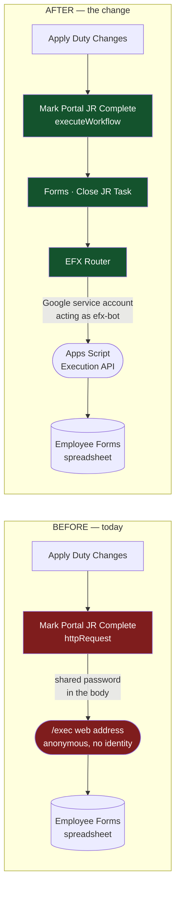
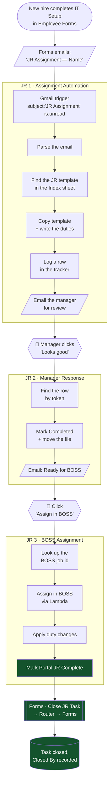
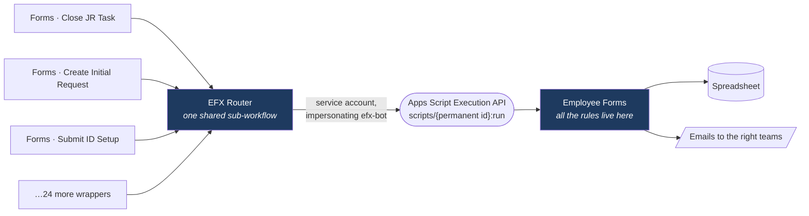

# The flow, in pictures

Three diagrams: what changes, the whole JR chain, and what the new door actually is.

---

## 1. The change — one node

**Red is what goes away:** a published address anyone can reach, gated only by a password, with no
record of who called it. **Green is what replaces it:** an identified call over a permanent id.

Everything to the left of that node is unchanged.

---

## 2. The whole JR chain

Three workflows, two human clicks. Only the last box on the right is new.

---

## 3. What the "door" actually is

The Router is one shared sub-workflow. Every capability is a thin wrapper over it — so adding the
next one costs a wrapper, not a new endpoint, new password and new deployment.

**The point of the shape:** n8n holds no business rules. Who may do what, what a valid hire looks
like, which team gets emailed, how employee numbers are issued — all of that stays in Forms. When
those rules change, nothing in n8n changes.

---

## Reading the arrows

| Symbol | Meaning |
|---|---|
| 👤 | A human clicks a button in an email |
| Green | New — the part this project adds |
| Red | Removed — the password-and-URL path |
| `[( )]` | Data at rest: the spreadsheet |
| `[/ /]` | An email leaving the system |
