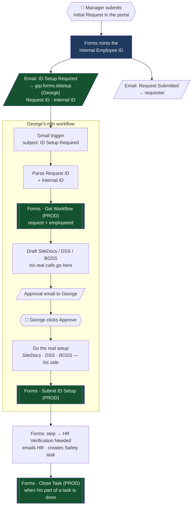
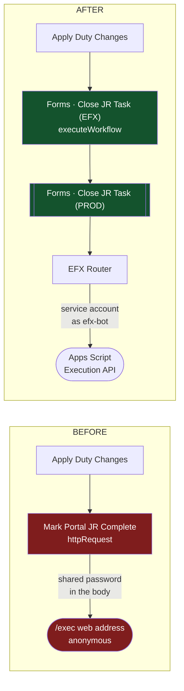
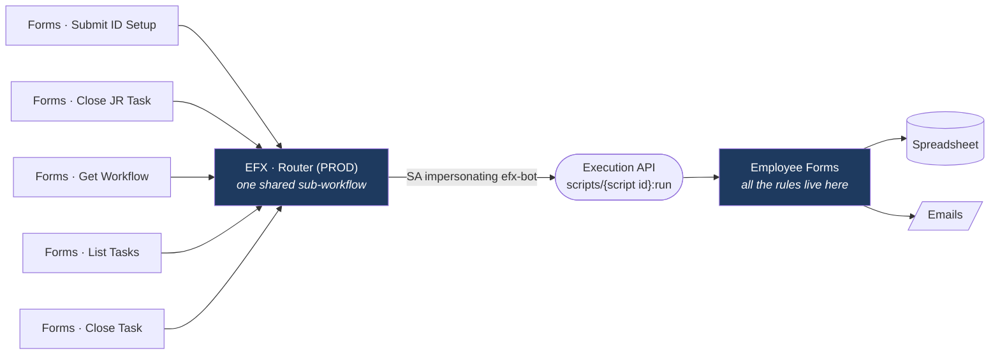

# The flow, in pictures

Three diagrams: George's hourly onboarding through the door, the JR one-node swap, and what the door is.

---

## 1. Hourly onboarding — George's flow

**Green is what this project adds:** the id in the email, and named calls into Forms. Everything inside the
dashed box is George's; the only things he calls are the green boxes.

---

## 2. JR — one node changes

Everything upstream of that node — Gmail trigger, parsing, tracker, approval, BOSS Lambda — is untouched.

---

## 3. What the door is

n8n holds no business rules and never writes to the spreadsheet. When the rules change, nothing in n8n changes.

| Symbol | Meaning |
|---|---|
| 👤 | A human acts |
| `[[ ]]` | A shared sub-workflow George calls by id |
| Green | Added by this project |
| Red | Removed: the password-and-URL path |
