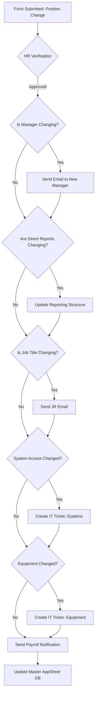
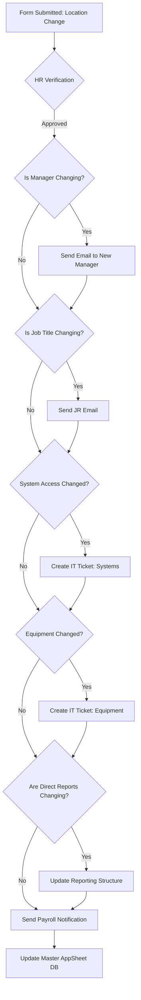
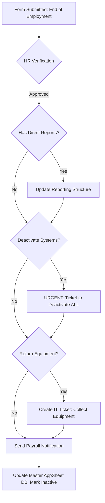

# Status Change Workflows Plan

This document outlines the form fields and backend actions needed for the three employee status change workflows in the Employee Management system.

---

## 1. Position / Job Title Change

This workflow is triggered when an employee changes roles, gets promoted, or reports to a new manager.

### Required Fields

- Requester Name (Text Input)
- Effective Date (Date)
- Employee Name (Text Input)
- New Job Title (Text Input) - *Note: If changing*
- New Manager (Text Input) - *Note: If changing*
- Reassign Direct Reports To (Text Input) - *Note: If manager changes*
- System Access Needed? (Radio: Yes/No) - *Note: For additions*
- Equipment Needed? (Radio: Yes/No) - *Note: For new equipment*

### Backend Logic Workflow

---

## 2. Location Change

This workflow is triggered when an employee changes their physical work location or site.

### Required Fields

- Requester Name (Text Input)
- Effective Date (Date)
- Employee Name (Text Input)
- New Site/Location (Dropdown)
- System Access Needed? (Radio: Yes/No) - *Note: For site-specific apps*

### Backend Logic Workflow

---

## 3. End of Employment (Termination)

This workflow is triggered when an employee leaves the company (resignation, termination, etc.).

### Required Fields

- Requester Name (Text Input)
- Effective Date (Date)
- Employee Name (Text Input)
- Reassign Direct Reports To (Text Input) - *Note: Required if manager*
- Deactivate All Systems (Checkbox)
- Return Equipment Checklist (Checkbox)

### Backend Logic Workflow

---

*Note: These workflows are designed to be dynamic. The UnifiedWorkflowPlanner HTML tool can be used to generate the exact JSON configurations that will drive the backend execution of these logic trees.*
